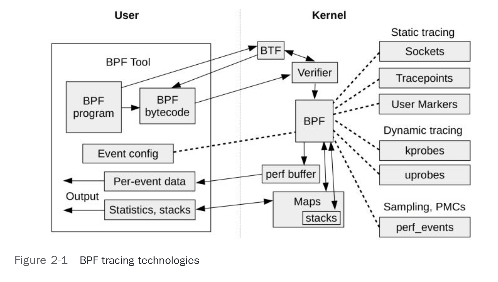

# Introduction

# What the Linux kernel does?

It is easy to forget when you only work on higher level software (like me).

- Is the first program that runs on your computer.
- Has has a higher level of control over the hardware.
- Gives programs access to hardware (through an interface called system calls).
- Allows for multiple programs to run at the same time (by time sharing activities in the available hardware).

<!-- pause -->

## The Kernel is very powerful.

Files ? Network ? Sound ? Sensors ? Kernel.

Even printing to the `terminal` requires the Kernel to be involved (`stdout` is the device 0).

To access hardware, our programs makes a system call.
The execution halts, and the kernel takes over. When complete, the program resumes.

(this is the User-Space - Kernel-Space switch)

<!-- pause -->

It's everywhere

<!-- end_slide -->

# What is eBPF

The extension of BPF (Berkeley Packet Filter, 1992), for networking filtering.
Nowadays, BPF == eBPF.

A program with two parts: User-Space and Kernel-Space (the BPF part).

- It is a way to run programs in the Kernel, like JavaScript in the browser.
- There is no need to recompile the Kernel, and it is safe to run.
- A lot safer than loading Kernel modules (and easier too).

## Use cases

- Tracing and Monitoring: see what runs in the Kernel, or user programs
- Security: detect or block malicious activity
- Networking: Controlling network traffic.

<!-- end_slide -->

# How does it Work?

<!-- column_layout: [1, 2] -->
<!-- column: 0 -->

1. User-Space part starts
2. Compiles the BPF program, sends it to Kernel
3. Program is received and Verified
4. Can be just-in-time compiled
5. Program is loaded, and attached to an event
6. On event, the Kernel will executes it
7. User Space handles shared data

<!-- column: 1 -->



_Figure 2-1 from the book 'Bpf performance tools: Linux system and application observability' by Gregg Brendan_

<!-- end_slide -->

# What the Kernel Provides (a non-exhaustive list)

## Tracepoints (Static instrumentation)

- Predefined points in the Kernel where you can attach your BPF program.

```c
DECLARE_TRACEPOINT(foo_bar);
static inline void some_inline_function(){
        if (tracepoint_enabled(foo_bar))
                do_trace_foo_bar_wrapper(args);
}
```

## `Kprobes` and `Uprobes` (Dynamic instrumentation)

- An instruction is replaced with a call to the BPF program.
- Can be inserted in (k)ernel functions and (u)ser functions
- There are also `Kretprobes` and `Uretprobes` (inserted after return)
- When removed the original instruction is restored

## Perf Events (another subsystem)

- Can do Sampling
- Can use hardware features (PMCs - Performance Monitoring Counters)

<!-- end_slide -->

# A shallow dive into the implementation: a simple BPF program

This program reports the number of times a System Call `execve` was called.

```c
struct bpf_map_def SEC("maps") kprobe_map = { //<--  Map to store results
  .type        = BPF_MAP_TYPE_ARRAY,
  .key_size    = sizeof(u32),
  .value_size  = sizeof(u64),
  .max_entries = 1,
};
SEC("kprobe/sys_execve")                      //<-- The event to monitor
int kprobe_execve() {                         //<-- The callable function
  u32 key     = 0;
  u64 initval = 1, *value_pointer;
  v_ptr = bpf_map_lookup_elem(&kprobe_map, &key); //<- Get value from map
  if (!v_ptr) {
    bpf_map_update_elem(&kprobe_map,          //<- Set initial value
              &key, &initval, BPF_ANY);
    return 0;
  }
  __sync_fetch_and_add(value_pointer, 1);     //<-- Increments the value
  return 0;
}
```

<!-- end_slide -->

# How to Load It Into The Kernel ?

- Compile the BPF program (clang/llvm)
- Load the BPF program into the Kernel (syscall)
- Load the interfaces to interact with the program (syscall)
- Attach the program to the desired event (syscall) ...

## Libraries to help

There are Libraries and frameworks to help

- BCC (BPF Compiler Collection) is one with C, Python and Lua bindings
- Cilium-ebpf in Go (it also generates Go code to interact with the BPF program)
- `bpftrace` has a simple high-level specific language

Example counting number of Syscalls per second:

```bash
bpftrace -e 'tracepoint:raw_syscalls:sys_enter { @ = count(); }
                                              interval:s:1
                                              { print(@); clear(@); }'
```

<!-- end_slide -->

# Go Time with the Cilium-ebpf library (setup)

The cilium-ebpf library pre-compiles the BPF program, and embeds into the output binary.

It also generates Go code to interact with the BPF program.

```go
// Load pre-compiled programs and maps into the kernel.
objs := bpfObjects{}

// This makes a few syscalls
loadBpfObjects(&objs, nil);
defer objs.Close()

// Name of the kernel function to trace.
fn := "sys_execve"

kp, err := link.Kprobe(fn, objs.KprobeExecve, nil)
if err != nil {
  log.Fatalf("opening kprobe: %s", err)
}
defer kp.Close()
```

<!-- end_slide -->

# Go Time with the Cilium-ebpf library (reading the output)

The results were stored in a map.

This will read the map every second and print the content.

```go
ticker := time.NewTicker(1 * time.Second)
defer ticker.Stop()

log.Println("Waiting for events..")

for range ticker.C {
  var value uint64
  if err := objs.KprobeMap.Lookup(mapKey, &value); err != nil {
    log.Fatalf("reading map: %v", err)
  }
  log.Printf("%s called %d times\n", fn, value)
}
```

<!-- end_slide -->

# In the Kernel

One SYSCALL, many commands.

```c
static int __sys_bpf(int cmd, bpfptr_t uattr, unsigned int size){
  union bpf_attr attr;
  /* copy attributes from user space, may be less than sizeof(bpf_attr) */
  memset(&attr, 0, sizeof(attr));
  if (copy_from_bpfptr(&attr, uattr, size) != 0)
    return -EFAULT;
  ...
  switch (cmd) {
  case BPF_MAP_CREATE:
    err = map_create(&attr);
    break;
    ...
  case BPF_PROG_LOAD:
    err = bpf_prog_load(&attr, uattr, size);
    break;
    ...
  case BPF_LINK_CREATE:
    err = link_create(&attr, uattr);
    break;
    ...
    default:
    err = -EINVAL;
    break;
}
```

<!-- end_slide -->

Attaching to the Events (many methods available)

```c
static int link_create(union bpf_attr *attr, bpfptr_t uattr){
  struct bpf_prog *prog;
  ...
  prog = bpf_prog_get(attr->link_create.prog_fd);
  switch (prog->type) { ...
  case BPF_PROG_TYPE_PERF_EVENT:
  case BPF_PROG_TYPE_TRACEPOINT:
    ret = bpf_perf_link_attach(attr, prog);
    break;
  case BPF_PROG_TYPE_KPROBE:
    if (attr->link_create.attach_type == BPF_PERF_EVENT)
      ret = bpf_perf_link_attach(attr, prog);  // our kprobe example
    else if (attr->link_create.attach_type == BPF_TRACE_KPROBE_MULTI)
      ret = bpf_kprobe_multi_link_attach(attr, prog); // uses fprobes
    else if (attr->link_create.attach_type == BPF_TRACE_UPROBE_MULTI)
  case BPF_PROG_TYPE_TRACING:
    if (prog->expected_attach_type == BPF_TRACE_RAW_TP)
      ret = bpf_raw_tp_link_attach(prog, NULL);
    else if (prog->expected_attach_type == BPF_TRACE_ITER)
      ret = bpf_iter_link_attach(attr, uattr, prog);
    else if (prog->expected_attach_type == BPF_LSM_CGROUP)
      ret = cgroup_bpf_link_attach(attr, prog);
    else
      ret = bpf_tracing_prog_attach(prog,...
      ...
    break;
  }
```

<!-- end_slide -->

## Demo Time

<!-- pause -->

- ciliumbpf kprobe + pretty shell -> bare bash shell -> ls
- BCC execsnoop + ls -> exit into my shell
- xdp + `ping 1.1.1.1 | ping 8.8.8.8`
- BCC gethostlatency + `curl google.com`

<!-- end_slide -->

# Thanks!

<!-- column_layout: [3, 5] -->
<!-- column: 0 -->

Based on my Post titled:

"Linux eBPF : Understanding Its Kernel-Level Mechanics"

Available at [rcpassos.me](https://rcpassos.me)

Thanks!

Rafael Passos

<!-- column: 1 -->


